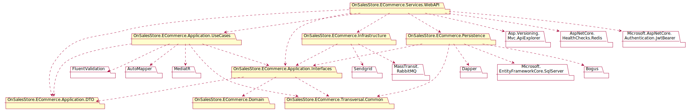

# OnSalesStore
OnSalesStore is a solution composed of modules with unique responsibilities that, when combined, enable the management of an e-commerce business (creates, deletes, updates, and queries).

## Architecture
The architecture consists of five layers: the service layer, the application layer, the infrastructure layer, the domain layer, and the traversal layer.

### Services Layer
It's the highest level layer, composed of a web service that uses the HTTP protocol. Its purpose is to transfer the data provided by the client to the server. It is 
also coupled to packets from lower layers and external packets that provide support for versioning, security, etc.

### Application Layer
It's the second-order layer, whose purpose is to implement the application logic and coordinate the flow of data between the domain layer and the outside world. 
It's composed of three packages.

* ___OnSalesStore.ECommerce.Application.DTO:___ It's a package that is responsible for providing the classes and primitive objects that are used in the data flow.
* ___OnSalesStore.ECommerce.Application.Interfaces:___ It's a package that defines the interfaces for external services or components of the application, which may include persistence, presentation, use cases, etc.
* ___OnSalesStore.ECommerce.Application.UseCases:___ It's a package that defines the use cases representing the specific actions that the application allows the user to make.

### Infrastructure Layer
It's a layer that is responsible for implementing the application layer interfaces for persistence and infrastructure. It's composed of three packages.

* ___OnSalesStore.ECommerce.Infrastructure:___ It's a package that is responsible that notifications via email using Sendgrid and message queuing using RabbitMQ.
* ___OnSalesStore.ECommerce.Persistence:___ It's a package that is responsible for the implementation of data persistence on SQL Server. It uses two data contexts implemented on EFCore and Dapper.

### Domain Layer
It's a layer that is responsible for representing the domain model while respecting the user's vocabulary. It also represents the business logic with its main rules and concepts. 

### Transversal Layer
It's a layer that is responsible for representing objects common to the entire application.
